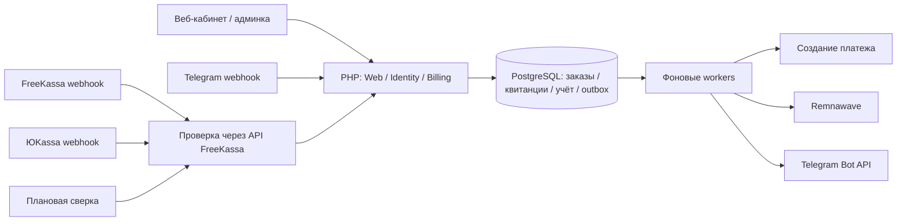

# Архитектура

## Решение

Модульный монолит на PHP 8.4+, компонентах Symfony 7.4 LTS, Twig, PDO и PostgreSQL 17. Это не стандартный Symfony FrameworkBundle scaffold: используются HttpFoundation, Routing, HttpClient, Console и Dotenv, зависимости явно собираются в Container. Выбранная [ветка Symfony 7.4](https://symfony.com/releases/7.4) имеет длительный цикл поддержки. Composer lock фиксирует фактические зависимости.

Веб — серверный HTML/Twig с адаптивным CSS. Покупка работает без JavaScript. SPA не нужна для текущих сценариев, а серверный рендер уменьшает количество независимых состояний клиента. HTTP-контроллеры и Telegram вызывают BillingService; в Telegram нет отдельного расчёта цены или изменения платёжного состояния.

## Billing core v3

Внутренний пользователь (`users.id`) отделён от способов входа в
`user_identities`. Telegram хранится как identity типа `telegram` с неизменяемым
numeric ID; `users.telegram_id` пока остаётся read-проекцией для совместимости
со старыми шаблонами и ботом. Новые операции должны читать identity-таблицу.

Заказ описывает намерение и его snapshot, строки находятся в `order_items`.
Попытка/факт оплаты — отдельная строка `payments`; принятые webhooks сначала
попадают в `payment_events`. Worker получает команду из outbox и выполняет
авторитетную проверку у провайдера, только затем запускает атомарный settlement.

`subscriptions.expires_at` — единственный бизнес-срок. Для тарифов с
`duration_months` период добавляется календарно с ограничением последним днём
целевого месяца; для legacy-тарифов используется `duration_days`.
`provisioning_accounts` хранит внешнее состояние отдельно от права пользователя:
оплата и продление завершатся, даже если Remnawave временно недоступен.

Полный список неизменяемых правил находится в [`ARCHITECTURE.md`](../ARCHITECTURE.md).

## Границы модулей

| Модуль | Ответственность |
|---|---|
| Identity | Пароли Argon2id, аккаунты, серверные сессии, rate limiting |
| Billing | Тарифные snapshots, заказ, подтверждение платежа, учёт, аудит |
| Integration | FreeKassa, ЮKassa, Remnawave, Telegram, демоадаптеры |
| Infrastructure | PDO, миграции, outbox, worker |
| Web | HTTP-маршруты, авторизация операций, CSRF, Twig |

Сейчас schema общая, SQL прост и явен. При расширении модулей выделять repositories и application commands, не превращать BillingService/Application в универсальные классы. Бизнес-инварианты нельзя переносить в шаблоны или адаптеры.

## Денежные инварианты

1. Только целые копейки BIGINT, валюта RUB. Значение от ЮKassa разбирается без float.
2. Сумма, срок, устройства и трафик копируются из тарифа в заказ. Изменение тарифа не меняет существующий заказ.
3. Ключ создания заказа уникален внутри пользователя. Повтор с другим тарифом отклоняется.
4. Платёж уникален по provider/payment_id и может оплатить только один заказ.
5. В одной транзакции фиксируются квитанция, две противоположные записи учёта, статус paid, подписка и outbox.
6. Внешний API не вызывается внутри транзакции оплаты. Падение панели не теряет оплаченный заказ.
7. Subscription/order_id уникален. Обработка второго уведомления не создаёт вторую подписку.
8. Учётные записи не редактируются через приложение. Возвраты потребуют отдельной компенсирующей операции; модуль возвратов пока отсутствует.

Парные записи — технический журнал биллинга, не полноценный бухгалтерский учёт с отложенным признанием выручки. База ограничивает уникальность, сервис обеспечивает нулевую сумму пары; `billing:audit` проверяет инварианты. Для разделения прав в production нужны отдельные migration/runtime DB-роли и запрет UPDATE/DELETE ledger/audit для runtime.

## Состояния и время

`pending → paid → fulfilled`; отмена провайдером допускается только из pending. Подписка `provisioning → active → expired`. Сейчас каждая покупка создаёт независимую подписку. Продление существующей, рекуррентность, кошелёк и смена тарифа не реализованы.

Время хранится в Unix UTC. Оплаченный срок начинается с фиксации оплаты; долгий простой выдачи не компенсируется автоматически. Перед коммерческим запуском нужно реализовать согласованную политику компенсаций. Повторы отправляют в Remnawave **один и тот же** expireAt: срок не увеличивается при каждом retry.

## Очередь и сбои

PostgreSQL outbox — единый durable источник заданий. `FOR UPDATE SKIP LOCKED` выдаёт разным worker разные задания. Lease 120 секунд, токен владельца защищает завершение чужой аренды. HTTP-вызов ограничен 20 секундами, типовая операция выдачи укладывается в lease. После падения процесс не нужен для восстановления: другой worker заберёт истёкший lease.

Гарантия доставки — **at least once**. Обещания exactly once для сети нет. Remnawave username детерминирован от subscription id; после таймаута сначала выполняется GET. Telegram sendMessage не имеет ключа идемпотентности: повтор уведомления после неоднозначного таймаута возможен. Денежные операции при этом не дублируются.

Backoff с jitter, 8 попыток, затем dead. Администратор может повторить dead-задание с записью в audit. У ЮKassa создание ограничено 23 часами от заказа, чтобы не выйти за 24-часовую гарантию provider idempotency и не создать новый платёж при позднем повторе. Такие заказы требуют ручной сверки; автоматического нового ключа нет.

## Масштабирование

Этап 1: один PostgreSQL primary, несколько PHP-FPM процессов и worker. Сессии/rate limits уже в БД, локальных пользовательских сессий нет. SQLite только для одиночной разработки.

Этап 2: несколько app-реплик за HTTPS балансировщиком, PgBouncer, отдельные пулы worker по темам, пакетная сверка и архивирование outbox/inbox. Сейчас worker общий и команда сверки выбирает все незавершённые платежи; для большой базы нужна пагинация и распределённый scheduler lock.

Этап 3 по измерениям: Redis для некритического кэша и ограничителей, broker для доставки после transactional outbox, read replica для отчётности. Деньги и состояние заказов остаются на primary. Не вводить распределённые транзакции и микросервисы до измеримой потребности.

## Контракты

- [ЮKassa: уведомления](https://yookassa.ru/developers/using-api/webhooks), [API](https://yookassa.ru/developers/api).
- [Telegram Bot API](https://core.telegram.org/bots/api#setwebhook).
- [Remnawave](https://github.com/remnawave/panel), [официальный Rust SDK](https://github.com/remnawave/rust-sdk).

HTTP mock-тесты подтверждают поведение нашего кода. Они не заменяют проверку payload и ответов установленной панели/реального магазина. Версия Remnawave для выпуска должна быть закреплена вместе с записанными контрактными fixtures.

## Изменения версии 0.2

Настройки сервиса вынесены из .env в app_settings. Секреты используют authenticated encryption XChaCha20-Poly1305; имя настройки входит в associated data. Master key хранится отдельным файлом, а не в БД. Payload outbox также шифруется и удаляется после успешной доставки. Изменение настроек сериализовано revision-lock; устаревшая форма не перезаписывает новое значение.

TelegramLogin разделяет browser challenge и magic link. В первом случае бот подтверждает identity, а consume требует независимый browser proof из HttpOnly cookie. Во втором bearer-токен действует 5 минут, передаётся в URL fragment и потребляется POST-запросом с CSRF. Токены в таблице только в виде SHA-256. Потребление и создание session выполняются одной транзакцией. Административные права в такой сессии требуют отдельного TOTP step-up.

TOTP: SHA-1, 30 секунд, 6 цифр, окно ±1 шаг с блокировкой повторного шага. Для первоначального подключения выдаются 8 одноразовых recovery-кодов. Коды не показываются повторно. Административная сессия требует MFA и имеет 15-минутное окно полномочий.

В заказ добавлены provision_driver, squad_uuid, provider_account, receipt_email, receipt_enabled, vat_code, tax_system и return_url. Это snapshots: повтор checkout не зависит от последующих изменений конфигурации. Remnawave и магазин нельзя незаметно заменить через обычную форму настроек. Ключи можно ротировать, но миграция identities — отдельная операция.

Runtime PostgreSQL отделён от владельца. Скрипт backup и интеграционный restore-test проверяют восстановление БД вместе с ключом. Конкретные пределы нагрузки, SLO, мониторинг и live-контракты требуют проверки на целевой инфраструктуре.

## Как работает биллинг (полная картина)

### Стек и процессы
- **PHP 8.4+, Symfony 7.4 LTS** (HttpClient/HttpFoundation/Routing), **Twig**, **PDO + PostgreSQL 17**. UI — серверный HTML/Twig, без SPA, покупка работает без JS.
- 4 PHP-контейнера: `app` (FPM, веб/кабинет/админка), `worker` (outbox-джобы), `scheduler` (Reconciler по таймеру), `bot` (Telegram long-polling/webhook). Все читают одну PostgreSQL `billing` и общий outbox. Nginx отдаёт статику из `public/`, PHP — из `/app/src`.
- Все зависимости собираются вручную в `Container.php` (не Symfony DI). Конфиг = `Settings::DEFAULTS` + env + переопределения из `app_settings` (секреты шифруются XChaCha20-Poly1305, master key в отдельном файле).

### Поток покупки (полный путь)
1. **Кабинет/Telegram → BillingService::order()** (HTTP-контроллеры и бот вызывают доменный сервис; в боте нет своего расчёта цены). В одной транзакции: валидация kill-switch (`PURCHASES_ENABLED`, `purchaseErrors`), idempotency-ключ `user_id+key`, снимок тарифа в заказ (`orders` + `order_items`), снапшот версии тарифа, `provider_account`, `return_url`, `receipt_*`. Сразу ставится `payment.create` в outbox.
2. **Worker: `payment.create`** → `PaymentService::createOrder()` → провайдер (Platega: `POST /v2/transaction/process` с `X-MerchantId`+`X-Secret`) → сохраняет `provider_payment_id`+`checkout_url`. Пользователь платит на `pay.platega.io`.
3. **Уведомление провайдера** (webhook) приходит на `/webhooks/{provider}`:
   - `WebhookGuard::claim()` — replay/tamper detection (sha256 payload, UNIQUE(provider, id), mismatch ⇒ tamper).
   - `PaymentEventStore::receive()` — durable inbox: вставляет `payment_events` (ack только после фикса), ставит `payment.event.process` в outbox. Webhook ≠ команда: settlement всегда через авторитетную проверку.
4. **Worker: `payment.event.process`** → `PaymentService::processEvent()` → `PaymentEventStore::claim()` (lease/блокировка) → если статус `canceled` — short-circuit (помечает заказы/topups отменёнными, ничего не списывает) → иначе `PaymentService::verify()`.
5. **`PaymentService::verify(payment_id)`** — авторитетная проверка у провайдера (`PlategaProvider::verify()` ⇨ `GET /transaction/{id}`, Platega возвращает `paymentDetails.amount` gross, `comission`; net = amount − comission). Возвращает `paid/canceled/pending` + net-копейки + привязку.
6. **Settlement → `BillingService::settle()`** — атомарно в одной транзакции (pg_advisory_xact_lock по `provider:payment_id`):
   - проверка привязки (заказ=провайдер, сумма net=price_minor, currency, `provider_payment_id` совпадает, не «уже использован», не «принадлежит другому заказу», заказ `pending`);
   - `payment_receipts` (UNIQUE provider+payment_id, один платёж = один заказ) + `payments` (UNIQUE provider+provider_payment_id) + две противоположные `ledger_entries` (двойная запись, нулевая сумма) + `orders→paid` + подписка (renewal ⇒ `extend()` существующей; новая ⇒ insert `subscriptions` + `provisioning_accounts` + `subscription.provision` в outbox) + `transactions` + аудит + timeline.
   - **Идемпотентно**: повторный verify/ретрай не создаёт вторую подписку (UNIQUE + advisory lock + payment_receipts).
7. **Worker: `subscription.provision`** → `RemnawaveProvisioner` (или demo). Успех ⇒ `subscriptions→active`, `remote_id`. Детерминированный username, GET-перед-таймаутом.
8. **`subscriptions.expires_at`** — единственный бизнес-срок. Оплата закрепляет права независимо от Remnawave: простой выдачи не отменяет оплату (только продление срока через отдельную компенсацию).

### Wallet / topups / бонусы
- `TopupService` — пополнение баланса (allowlist провайдеров, idempotency, settle по net аналогично заказу). `Wallet` — баланс из approved минус applied.
- `AutoPurchaseService` — автопокупка после пополнения. `PromoCodeService`, `CartService`, `GiftService`, `TrialService`, `ReferralService` (партнёрские комиссии), `CreatorService` (комиссия создателя-контента, отдельный ledger), `ContestService`/`PollService`/`CampaignService` — промо.
- `SubscriptionService` — `extend()` (продление от max(now, expires_at)+дней), `expiryAfter()` (календарные месяцы с ограничением последним днём), авто-renew через Reconciler.

### Очередь (outbox) — сердце надёжности
- `Outbox` — durable-очередь в PostgreSQL. `FOR UPDATE SKIP LOCKED` раздаёт разным workers разные задания. Lease 120с + lock_token (чужой lease не завершишь). **at-least-once**: повторы безопасны благодаря идемпотентности денег.
- Retry: exp-boosted backoff + jitter, 8 попыток → `dead` (админ может повторить из панели). `JobDeferred` (safe mode/пауза) — не тратит попытки.
- Приоритеты: `payment.verify`/`payment.event.process`=100, `payment.create`/`topup.create`=90, provisioning=80, telegram=60, broadcast=10.
- Payload шифруется (enc:) и очищается после done.

### Reconciler (scheduler, каждую минуту) — самовосстановление
- Advisory-lease (один scheduler). Запускает `ConsistencyChecker` (drift payments/ledger/order-статус; не-деструктивно, пишет в `consistency_checks`).
- **Re-verify pending-заказов/topups с `provider_payment_id`** — если webhook потерян, тут подберёт.
- Requeue stale `payment_events` (истёкший lease), повторная выдая `subscription.provision`/`extend` для stuck/retry, авто-renew, Remnawave sync (раз в час, `reconciliation.auto_heal`), self-heal expiry (`status/lifecycle_status` → expired), авто-close устаревших operational_cases, flush mail, чистка устаревших sessions/rate_limits/outbox(done>30д).

### Защита/стейки (security & monetary)
- **KillSwitch**: safe mode (`SAFE_MODE`) замораживает всю финансовую поверхность; kill-switches `global_purchases`, `provider.{id}`, `remnawave_provision`, `financial_freeze`. `assertCanPurchase/Provision/Withdraw`.
- **CircuitBreaker**: вокруг интеграций — при падении провайдера размыкается, не сыпет ретраи в мёртвый API.
- **RateLimiter** (фиксированное окно), **WebhookGuard** (replay/tamper), **SecretRedactor** (не пишем токены/URL в логи).
- **Четыре глаза (FourEyes)** + **RBAC + Permissions + OptimisticLock** + **audit_log** (неизменяемый) — административные изменения.
- **Identity**: Argon2id, серверные сессии, TelegramLogin (browser challenge + magic-link, токены только SHA-256, HttpOnly), MFA (TOTP окно ±1, recovery-коды, step-up), rate limiting на вход.
- **Двухфазное подтверждение платежа**: webhook (inbox) → авторитетный verify у провайдера → settle. Никогда не доверяем браузеру/вебхуку суммы.
- **Net-сумма (Platega)**: для сверки и settle используется `paymentDetails.amount − comission` (net), что совпадает с суммой заказа. Gross читать нельзя — комиссия ~9% ломает сверку.
- **Защита «оплатил, но не выдано» (delivery_gap)**: `ConsistencyChecker::deliveryGaps()` находит succeeded-платежи, чей заказ не paid/fulfilled; Reconciler поднимает видимую dedup-операцию `payment.delivery_gap` (failed, «Клиент заплатил, но услуга не выдана — зачислите вручную»). Сейчас по решению оператора — только алерт, без авто-дозачисления/возврата.

### Критические инварианты (подтверждены fault-аудитами)
- Двойной/параллельный settle ⇒ 1 платёж + 1 подписка.
- Неверная сумма/валюта/провайдер ⇒ отклонение, заказ остаётся pending.
- Повтор webhook / реплей / таймаут ⇒ идемпотентно.
- Один платёж провайдера нельзя привязать к двум заказам/подпискам.
- Reconciliation-дрейф самовосстанавливается; ledger/audit нередактируемы.
<!-- project: path:/home/openclaw/.openclaw/.openclaw/workspace -->
