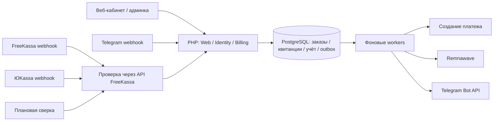

# Архитектура

## Решение

Модульный монолит на PHP 8.4+, компонентах Symfony 7.4 LTS, Twig, PDO и PostgreSQL 17. Это не стандартный Symfony FrameworkBundle scaffold: используются HttpFoundation, Routing, HttpClient, Console и Dotenv, зависимости явно собираются в Container. Выбранная [ветка Symfony 7.4](https://symfony.com/releases/7.4) имеет длительный цикл поддержки. Composer lock фиксирует фактические зависимости.

Веб — серверный HTML/Twig с адаптивным CSS. Покупка работает без JavaScript. SPA не нужна для текущих сценариев, а серверный рендер уменьшает количество независимых состояний клиента. HTTP-контроллеры и Telegram вызывают BillingService; в Telegram нет отдельного расчёта цены или изменения платёжного состояния.

## Границы модулей

| Модуль | Ответственность |
|---|---|
| Identity | Пароли Argon2id, аккаунты, серверные сессии, rate limiting |
| Billing | Тарифные snapshots, заказ, подтверждение платежа, учёт, аудит |
| Integration | FreeKassa, ЮKassa, Remnawave, Telegram, демоадаптеры |
| Infrastructure | PDO, миграции, outbox, worker |
| Web | HTTP-маршруты, авторизация операций, CSRF, Twig |

Сейчас schema общая, SQL прост и явен. При расширении модулей выделять repositories и application commands, не превращать BillingService/Application в универсальные классы. Бизнес-инварианты нельзя переносить в шаблоны или адаптеры.

## Денежные инварианты

1. Только целые копейки BIGINT, валюта RUB. Значение от ЮKassa разбирается без float.
2. Сумма, срок, устройства и трафик копируются из тарифа в заказ. Изменение тарифа не меняет существующий заказ.
3. Ключ создания заказа уникален внутри пользователя. Повтор с другим тарифом отклоняется.
4. Платёж уникален по provider/payment_id и может оплатить только один заказ.
5. В одной транзакции фиксируются квитанция, две противоположные записи учёта, статус paid, подписка и outbox.
6. Внешний API не вызывается внутри транзакции оплаты. Падение панели не теряет оплаченный заказ.
7. Subscription/order_id уникален. Обработка второго уведомления не создаёт вторую подписку.
8. Учётные записи не редактируются через приложение. Возвраты потребуют отдельной компенсирующей операции; модуль возвратов пока отсутствует.

Парные записи — технический журнал биллинга, не полноценный бухгалтерский учёт с отложенным признанием выручки. База ограничивает уникальность, сервис обеспечивает нулевую сумму пары; `billing:audit` проверяет инварианты. Для разделения прав в production нужны отдельные migration/runtime DB-роли и запрет UPDATE/DELETE ledger/audit для runtime.

## Состояния и время

`pending → paid → fulfilled`; отмена провайдером допускается только из pending. Подписка `provisioning → active → expired`. Сейчас каждая покупка создаёт независимую подписку. Продление существующей, рекуррентность, кошелёк и смена тарифа не реализованы.

Время хранится в Unix UTC. Оплаченный срок начинается с фиксации оплаты; долгий простой выдачи не компенсируется автоматически. Перед коммерческим запуском нужно реализовать согласованную политику компенсаций. Повторы отправляют в Remnawave **один и тот же** expireAt: срок не увеличивается при каждом retry.

## Очередь и сбои

PostgreSQL outbox — единый durable источник заданий. `FOR UPDATE SKIP LOCKED` выдаёт разным worker разные задания. Lease 120 секунд, токен владельца защищает завершение чужой аренды. HTTP-вызов ограничен 20 секундами, типовая операция выдачи укладывается в lease. После падения процесс не нужен для восстановления: другой worker заберёт истёкший lease.

Гарантия доставки — **at least once**. Обещания exactly once для сети нет. Remnawave username детерминирован от subscription id; после таймаута сначала выполняется GET. Telegram sendMessage не имеет ключа идемпотентности: повтор уведомления после неоднозначного таймаута возможен. Денежные операции при этом не дублируются.

Backoff с jitter, 8 попыток, затем dead. Администратор может повторить dead-задание с записью в audit. У ЮKassa создание ограничено 23 часами от заказа, чтобы не выйти за 24-часовую гарантию provider idempotency и не создать новый платёж при позднем повторе. Такие заказы требуют ручной сверки; автоматического нового ключа нет.

## Масштабирование

Этап 1: один PostgreSQL primary, несколько PHP-FPM процессов и worker. Сессии/rate limits уже в БД, локальных пользовательских сессий нет. SQLite только для одиночной разработки.

Этап 2: несколько app-реплик за HTTPS балансировщиком, PgBouncer, отдельные пулы worker по темам, пакетная сверка и архивирование outbox/inbox. Сейчас worker общий и команда сверки выбирает все незавершённые платежи; для большой базы нужна пагинация и распределённый scheduler lock.

Этап 3 по измерениям: Redis для некритического кэша и ограничителей, broker для доставки после transactional outbox, read replica для отчётности. Деньги и состояние заказов остаются на primary. Не вводить распределённые транзакции и микросервисы до измеримой потребности.

## Контракты

- [ЮKassa: уведомления](https://yookassa.ru/developers/using-api/webhooks), [API](https://yookassa.ru/developers/api).
- [Telegram Bot API](https://core.telegram.org/bots/api#setwebhook).
- [Remnawave](https://github.com/remnawave/panel), [официальный Rust SDK](https://github.com/remnawave/rust-sdk).

HTTP mock-тесты подтверждают поведение нашего кода. Они не заменяют проверку payload и ответов установленной панели/реального магазина. Версия Remnawave для выпуска должна быть закреплена вместе с записанными контрактными fixtures.

## Изменения версии 0.2

Настройки сервиса вынесены из .env в app_settings. Секреты используют authenticated encryption XChaCha20-Poly1305; имя настройки входит в associated data. Master key хранится отдельным файлом, а не в БД. Payload outbox также шифруется и удаляется после успешной доставки. Изменение настроек сериализовано revision-lock; устаревшая форма не перезаписывает новое значение.

TelegramLogin разделяет browser challenge и magic link. В первом случае бот подтверждает identity, а consume требует независимый browser proof из HttpOnly cookie. Во втором bearer-токен действует 5 минут, передаётся в URL fragment и потребляется POST-запросом с CSRF. Токены в таблице только в виде SHA-256. Потребление и создание session выполняются одной транзакцией. Административные права в такой сессии требуют отдельного TOTP step-up.

TOTP: SHA-1, 30 секунд, 6 цифр, окно ±1 шаг с блокировкой повторного шага. Для первоначального подключения выдаются 8 одноразовых recovery-кодов. Коды не показываются повторно. Административная сессия требует MFA и имеет 15-минутное окно полномочий.

В заказ добавлены provision_driver, squad_uuid, provider_account, receipt_email, receipt_enabled, vat_code, tax_system и return_url. Это snapshots: повтор checkout не зависит от последующих изменений конфигурации. Remnawave и магазин нельзя незаметно заменить через обычную форму настроек. Ключи можно ротировать, но миграция identities — отдельная операция.

Runtime PostgreSQL отделён от владельца. Скрипт backup и интеграционный restore-test проверяют восстановление БД вместе с ключом. Конкретные пределы нагрузки, SLO, мониторинг и live-контракты требуют проверки на целевой инфраструктуре.
